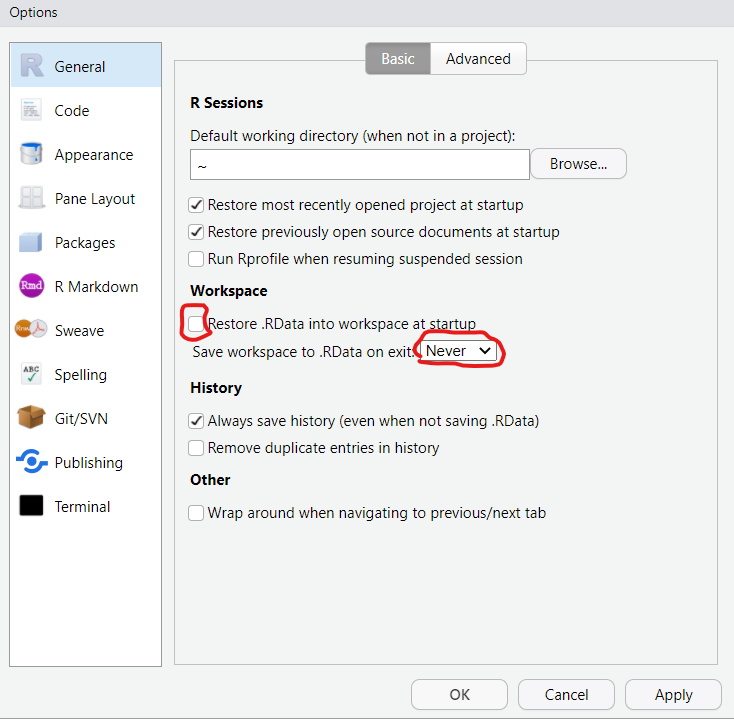

```{r setup, include=FALSE}
knitr::opts_chunk$set(echo = TRUE)
```

## Setting up your R environment

Typically people use R along with a development envrionment like RStudio, RStudio Server, or Jupyter. RStudio Server is set up by your IT department, accessed through a web browser and runs only on Linux. RStudio desktop can be downloaded and installed for free on any desktop computer. Jupyter can be installed on a remote server or hosted locally, sometimes in a Docker container.

Before we can use the analytic tools provided by Hades we need to set up our analytic envrionment and make sure everything is installed and working. Since Java is a fundamental dependency to many of the Hades packages we will install Java and the R wrapper, rJava, first.

Installing Java will depend on your system and is done outside of R. You want to install the Oracle JDK (64 bit version if on Windows).

To verify that Java has been installed on your system run
```{r}
system("java -version")
```


If you get a version number instead of an error then you should be good to go. Next we will install the rJava package which lets us access compiled Java code from R.

```{r, eval=F, message=F}
install.packages("rJava")
```

```{r}
library(rJava)
.jinit()
print(.jclassPath())
```

If you see a path instead of an error then rJava is working.

# Create a Github account and personal access token
Since many of the OHDSI packages are released on github.com you will need to download the packages from github. While it is possible to download a few packages without an account you will want to create an account and a personal access token if you are going to be installing many OHDSI packages.

- Go to https://github.com/ to sign up for an account
- Create a personal access token by following the instructions at https://docs.github.com/en/github/authenticating-to-github/creating-a-personal-access-token

Once you have your personal access token we need to save it along with other sensitive information in our .Renviron file so that we can access these values using environment variables throughout the course.

Open your .Renviron file by running
```{r, eval=F}
# install.packages("usethis)
usethis::edit_r_environ()
```

Add your github personal access token along with your database password

```{}
GITHUB_PAT=llksdjsdfjsdw98sd88sdf9sdf990sdf89we0sd9fsdf9009w9
DB_PASSWORD=PutYourDatabasePasswordHere
WEBAPI_PASSWORD=PutYourAtlasPasswordHere
DB_SERVER=https://mydatabaseserver
```

Save and close the file. This is the one and only place where we will store our passwords in plain text. 

We can protect this file by running
```{r, eval=F}
system("ls -la ~/.Renviron") # default permissions
system("chmod 600 ~/.Renviron")
system("ls -la ~/.Renviron") # restricted permissions
```


# Install Hades

Hades consists of a large number of packages. Instead of installing them all separately we can install them all at once by installing the Hades pacakage. This can take a while to run. Foruntately all of the packages have been pre-installed on this server but feel free to run the code below to see the process.

```{r, eval=F}
remotes::update_packages()
devtools::install_github("OHDSI/Hades", upgrade = "never")
```

Installation seems to go more smoothly if we separate the tasks of ugrading existing packages and installing new ones (ie first upgrage everything, then install new packages).

Typically you will want to work with the latest releases of each of the OHDSI R packages. However there may be instances when you need to install an older version of a package. To do this simply include the version number when installing.

```{r, eval=F}
devtools::install_github("OHDSI/CohortDiagnostics", ref = "v1.2.2", upgrade = "never")
```


# Install additional packages

There are some additional packages that will also be helpful so let's make sure those are installed as well.

```{r, eval=F}
install.packages("tidyverse", lib = .libPaths()[1])
install.packages("renv")
install.packages("RPostgreSQL")
devtools::install_github("OHDSI/DataQualityDashboard", ref = "v1.2")
```

## Sidebar: Library locations

Where are these packages installed? There can actually be multiple R libraries and we can find their locations using the `.libPaths()` function.
```{r}
.libPaths()
```

Notice that there is a user specific library as well as global computer specific library. When we are installing packages they are being saved on our local user specific library. The global library is managed by the computer's admin. It is also possible to create a project specific package library using the `renv::init()` function. This makes your project more self-contained and less dependent on code outside of the project. It also allows use to snapshot the state of our project's dependencies and restore them at a future point in time. See https://rstudio.github.io/renv/articles/renv.html for details.


# Set global options in RStudio
The following changes to RStudio make life easier. The purpose of these changes is to give us a clean R working environment every time R restarts. It is preferred to always start fresh and consider objects in the global enviornment as transient. Code and explicitly saved files and objects are the things that persist from session to session.

In RStudio open tools -> Global Options
Make sure the "restore workspace to .Rdata at startup" is not checked 
Set "Save workspace to .Rdata on exit" to Never



A really short program to check that we have the Hades R packages installed an working is

```{r}
library(Hades)
library(DatabaseConnector)
library(Eunomia)

connectionDetails <- getEunomiaConnectionDetails()
createCohorts(connectionDetails)
connection <- connect(connectionDetails)

sql <- "SELECT COUNT(*)
FROM main.cohort
WHERE cohort_definition_id = 1;"

renderTranslateQuerySql(connection, sql)

disconnect(connection)
```

Now that we have packages installed and working we can move on to querying the CDM from R in the next notebook. It is a good habit to restart R frequently so before we move on try restarting your R session by selecting "Session -> restart R" from the RStudio menu or using the ctrl+shift+F10 keyboard shortcut. This will clear our global environment (workspace) and ensure we are starting with a fresh R environment.


